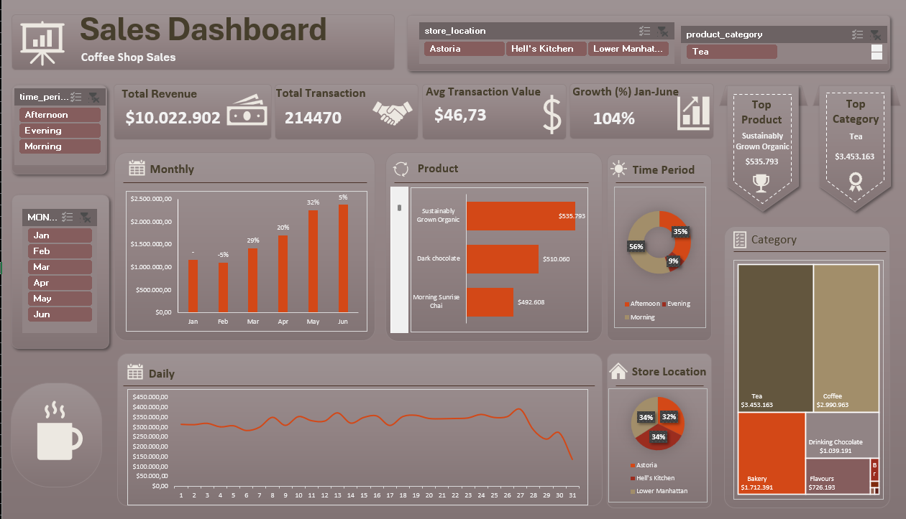

# Coffee Shop Sales Performance Analysis

Excel-based sales analytics project transforming 149,000+ raw transaction records into an interactive business dashboard. The workflow covers data cleaning, feature engineering, and pivot-based analysis to surface revenue trends, product performance, and store-level insights for a multi-location coffee shop chain in New York, NY (Lower Manhattan, Hell's Kitchen, Astoria).

## Key Results

- **Total Revenue:** $10,022,902 across 214,470 units sold
- **149,000+ transaction records** cleaned and structured from raw POS data
- **~107% revenue growth** from January to June 2023
- **Tea** was the highest-revenue product category ($260,388 in June alone)
- Sales patterns analyzed by time period (Morning/Afternoon/Evening), store location, product category, product segment, and product detail

## Questions (KPIs)

- What is the total revenue, total transactions, and month-over-month growth trend?
- Which month generated the highest revenue?
- Which product category and product type generate the most revenue?
- Which individual products are the top sellers by revenue and quantity sold?
- Which time period (Morning, Afternoon, Evening) generates the most sales?
- Which store location performs best in terms of revenue?
- How does revenue trend across product segments (Consumables vs. Non-Consumables)?
- What is the average transaction value per month?

## Dashboard Preview

## Key Insights

- **Revenue grew steadily from January to June 2023**, rising from $1,162,148 to $2,374,174 — a **104% increase** over the period, with February being the only month of decline (-5%) before accelerating through Q2.
- **Tea is the top-grossing category** ($3,453,163), narrowly ahead of Coffee ($2,990,963), together accounting for over 64% of total revenue. Bakery ranks third ($1,712,391).
- **"Sustainably Grown Organic" coffee is the single highest-revenue product** ($535,793), followed by other specialty coffee and chai/tea blends.
- **Consumables dominate sales** ($9,959,176, ~99.4% of revenue) versus Non-Consumables/Branded merchandise ($63,726), indicating the business is almost entirely driven by in-store drink and food purchases rather than retail add-ons.
- **Mornings drive the majority of revenue** ($5,553,830), nearly 60% of total sales, far ahead of Afternoon ($3,534,243) and Evening ($934,829) — suggesting a strong commuter/breakfast customer base.
- **Lower Manhattan is the top-performing location** ($3,411,561), followed closely by Hell's Kitchen ($3,367,140) and Astoria ($3,244,201) — performance across the three stores is relatively balanced.

## Recommendations

- **Double down on Tea and Coffee assortments** during promotions, since these two categories drive the majority of revenue; consider seasonal or limited-edition blends to sustain growth momentum seen in Q2.
- **Extend or promote morning offerings** (e.g. breakfast bundles, loyalty perks) to reinforce the already-strong morning traffic, and test targeted evening promotions to lift the comparatively low evening revenue.
- **Investigate the February revenue dip** to identify seasonal or operational causes (e.g. post-holiday slowdown) and plan mitigating promotions for the same period going forward.
- **Explore growth opportunities in Non-Consumables/Branded merchandise**, which currently contributes under 1% of revenue — even modest cross-sell of branded mugs, beans, or gift items could add incremental revenue with existing foot traffic.
- **Use Astoria's relatively lower performance** as a benchmark to review staffing, local marketing, or product mix compared to the two stronger-performing locations.

## Limitations

- Dataset covers only **6 months (January–June 2023)** across **3 New York store locations**, so findings may not generalize to other seasons or markets.
- No customer-level demographic data is available, limiting analysis to product, time, and location dimensions only.

## Project Structure

| Sheet | Description |
|---|---|
| **InputData** | Cleaned transaction-level dataset (149K+ rows, 18 columns) with 5 engineered columns (Product, Total Revenue, Day, Month, Year) added on top of the original raw fields to support aggregation and pivoting |
| **Analysis** | PivotTables breaking down revenue by month, product, category, segment, time period, and store location, including month-over-month growth calculations |
| **Dashboard** | Interactive dashboard with slicers for dynamic filtering across dimensions |

> Note: The original raw transaction data sheet was removed from this workbook to keep file size under GitHub's upload limit. InputData retains the full cleaned dataset used for analysis.

## Data Source

Raw transaction data sourced from [Coffee Shop Sales – Maven Analytics Data Playground](https://mavenanalytics.io/data-playground/coffee-shop-sales), a public domain dataset of transaction records for Maven Roasters, a fictitious coffee shop operating out of three NYC locations (Lower Manhattan, Hell's Kitchen, Astoria).

## Workflow

1. **Data Cleaning** — Raw transaction data validated and structured
2. **Feature Engineering** — Derived fields added (Total Revenue, Day, Month, Year, Product) to enable time-based and product-based aggregation
3. **Analysis** — PivotTables built on InputData to calculate revenue by category, product, time period, and location, plus month-over-month growth rate
4. **Visualization** — Dashboard sheet consolidates key metrics and PivotCharts with interactive slicers for exploration

## Tools

Microsoft Excel (PivotTables, PivotCharts, Slicers, formulas for feature engineering)

## Skills Demonstrated

Data cleaning · Feature engineering · Exploratory data analysis · KPI reporting · Dashboard design · Business insight generation
